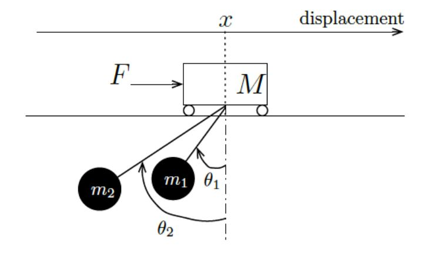

# Project - Inverted-Pendulum-Controller
The Problem statement for this project is explained in the `doc/ProblemStatement.pdf`

<em>Inverted Pendulum Model</em>

### This Project:

* Implements an LQR Controller
* Simulates the response for initial conditions
* Linearizes the system and simulates the response
* Implements the Non-linear system and simulates the response
* Uses the Lyapunov's indirect method to certify Stability of the system
* Identifies the combination of Input and Output where the system is Observable
* Obtains the Luenberger Observer and SImulates the responses for both Linearized system and Original Non-Linear system

## Dependencies

* Matlab 2018a and above

## Execution

* Run the live scripts provided in the `mcodes/` to reproduce the results
* View the plots in the `plots/` to view the results

## Results
The mathematical derivations and outputs are explained in the report `doc/Report.pdf` 

Note: Some of the results are not good. This project needs more improvement

## See how it works

<em>Non-linear response of the system with LQR Controller</em>

